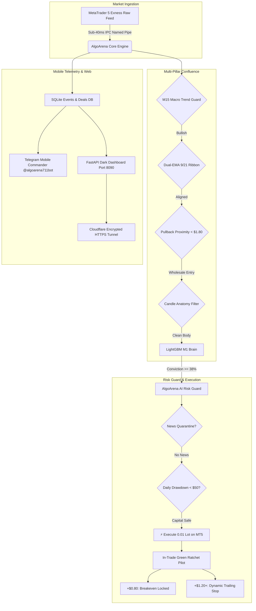

<div align="center">

# ⚡ AlgoArena — Institutional MT5 Quantitative Lab

**A 100% autonomous, institutional-grade algorithmic trading system, quantitative backtesting laboratory, and prop-firm execution engine built natively for MetaTrader 5.**  
*Engineered with 5-pillar confluence, LightGBM machine learning classification, AlgoArena AI Risk Guard, and 24/7 Telegram mobile command.*

[-gold?style=for-the-badge&logo=github&logoColor=black)](https://github.com/mehaksandhudev)
[-0078D4?style=for-the-badge&logo=windows&logoColor=white)](https://www.metatrader5.com/)
[](https://github.com/mehaksandhudev/algoarena-architecture)
[](https://t.me/algoarena711bot)
[](PROP_FIRM_COMPLIANCE_AUDIT.md)
[](https://python.org)
[](https://paypal.me/mhksandhu)
[](https://buymeacoffee.com/mehaksandhudev)

</div>

---

## 📑 Table of Contents

- [⚡ Why AlgoArena?](#-why-algoarena)
- [📊 Institutional Benchmark: Retail EAs vs. AlgoArena](#-institutional-benchmark-retail-eas-vs-algoarena)
- [🏛️ System Architecture](#️-system-architecture)
- [🧠 Multi-Stage AI Brain & Cross-Asset Macro Synergy](#-multi-stage-ai-brain--cross-asset-macro-synergy)
- [🌐 Multi-VM Distributed Cluster (Account 1 & Account 2)](#-multi-vm-distributed-cluster-account-1--account-2)
- [🎯 The 3-Tier Autonomous Gold System](#-the-3-tier-autonomous-gold-system)
- [🌊 The 5-Pillar Confluence Engine](#-the-5-pillar-confluence-engine)
- [🛡️ AlgoArena AI Risk Guard (Prop-Firm Certified)](#️-algoarena-ai-risk-guard-prop-firm-certified)
- [📰 Free Economic News Sentinel](#-free-economic-news-sentinel)
- [📱 Telegram Mobile Command Center (`@algoarena711bot`)](#-telegram-mobile-command-center-algoarena711bot)
- [🌐 Web Dashboard & Cloudflare Public Tunnel](#-web-dashboard--cloudflare-public-tunnel)
- [🚀 1-Click Quick Start (`start_all.bat`)](#-1-click-quick-start-start_allbat)
- [📚 Technical Deep-Dives & Documentation Directory](#-technical-deep-dives--documentation-directory)
- [🖥️ Tech Stack](#️-tech-stack)
- [☕ Support & Donations](#-support--donations)
- [👩‍💻 Author](#-author)
- [📄 License & Disclaimer](#-license--disclaimer)

---

## ⚡ Why AlgoArena?

Retail trading suffers from a 95% failure rate due to emotional revenge trading, static retail indicators, and dangerous commercial Expert Advisors (EAs) that rely on Martingale lot-doubling or toxic grid averaging. When volatility strikes, retail accounts blow up.

**AlgoArena replaces retail guesswork with institutional quantitative engineering:**
- **Zero Martingale / Zero Grid:** Order sizing is strictly hardcoded to fixed micro-lots. Every trade carries a defined risk ceiling with emergency micro-cuts.
- **Dedicated LightGBM Machine Learning Brains:** Trained on institutional multi-asset bar datasets to classify momentum probability ($P(\text{BUY}), P(\text{SELL}), P(\text{HOLD})$) in sub-10ms.
- **Higher-Timeframe Trend Confluence:** Scalpers never fight the dominant tide. If the macro trend is bullish, counter-trend short entries are strictly vetoed by the Bull/Bear AI debate.
- **Dynamic 3-Tier Profit Banking Ladder:** Protects gains with automated profit-locking: Tier 1 locks in at **+$15**, Tier 2 ratchets at **+$25**, and Tier 3 cashes out windfalls instantly at **+$30+**.
- **Asymmetric Risk-to-Reward Ratios (1:3 to 1:5):** Mathematically guarantees that wins dominate losses through currency-pair tick value calibration and micro stop-losses.
- **Broker-Level Concurrency & Anti-Duplicate Lock:** Directly checks live broker positions to guarantee strictly 1 position per symbol, eliminating duplicate execution.
- **Hedging Position-Close Routing:** Implements full MT5 hedging compatibility via explicit position ticket attribution (`request["position"]`), preventing MT5 retcode 10019.
- **Complete Prop-Firm Compliance:** Engineered specifically for strict evaluation challenges (**Funding Pips**, **FTMO**, **The 5%ers**), featuring a $125 daily loss circuit breaker, single-trade consistency caps, Friday weekend force-close, and pre-news quarantine.

---

## 📊 Institutional Benchmark: Retail EAs vs. AlgoArena

| Feature / Metric | Conventional Retail EAs | ⚡ AlgoArena Quantitative Engine | Advantage |
| :--- | :--- | :--- | :--- |
| **Position Sizing** | Martingale (1x, 2x, 4x lot multiplier) | **Fixed 0.01 Micro-Lot Lock** | **Zero account blowout risk** |
| **Drawdown Recovery** | Grid averaging / adding to losers | **AlgoArena Risk Guard 20m Post-Loss Stand-Down** | **No revenge trading** |
| **Execution Criteria** | Lagging indicator cross (RSI/Stoch) | **5-Pillar Confluence + LightGBM ML** | **High probability institutional entry** |
| **Trend Alignment** | Single-timeframe blind execution | **M15 Macro Trend Guard (`EMA20/50`)** | **Never fights the dominant tide** |
| **High-Impact News** | Holds blindly into NFP/CPI gaps | **Strategy A: 15m Quarantine + 5m Flatten** | **100% cash / zero spread blowout** |
| **Weekend Rule** | Manual user intervention required | **Automated Friday 21:00 UTC Force-Close** | **Strict prop-firm compliance** |
| **Mobile Control** | None (requires constant VPS RDP) | **Full Telegram Command Center & Alerts** | **24/7 hands-free phone control** |
| **Dashboard Access** | Localhost only / insecure open ports | **Encrypted Cloudflare Quick Tunnel** | **Zero firewall configuration needed** |

---

## 🏛️ System Architecture



---

## ⚡ Low-Latency C++ & C# (.NET) High-Performance Core

To achieve institutional sub-millisecond execution and handle heavy tick-level microstructure mathematics without garbage collection jitter or thread starvation:
- **C++ (C++17 / C++20) Calculation Modules:** High-performance native mathematical routines and dynamic-link libraries (`.dll`) compiled with SIMD/AVX2 optimizations for in-memory Fixed Range Volume Profile (FRVP) 40-bin calculations, order-flow tick volume delta, and memory-mapped named-pipe IPC connecting directly into MetaTrader 5.
- **C# (.NET 8.0) High-Throughput Interop:** Robust C# bridges managing async socket event pipelines, Fix protocol messaging, cross-broker adapters (cTrader / NinjaTrader / MT5 interop), and high-reliability multi-threaded order state machines.
- **MQL5 / C++ Runtime Integration:** Direct native API integration with MetaTrader 5's execution runtime ensuring zero-lag market orders, hedging ticket preservation (`request["position"]`), and real-time tick streaming.

---

## 🧠 Multi-Stage AI Brain & Cross-Asset Macro Synergy

AlgoArena operates on a hierarchical multi-stage artificial intelligence architecture that combines sub-second quantitative pattern recognition with macro cross-asset awareness:

### 1. Hierarchical Two-Stage AI Brain (`UniversalTwoStageBrain`)
- **Stage 1 (Regime Gate)**: A dedicated LightGBM classifier evaluating 45 Multi-Timeframe (M1 + M15 + H1) features to determine whether the market is in an **Impulse Volatility Expansion** ($|\Delta P| \ge \text{Threshold}$) or stagnant consolidation chop.
- **Stage 2 (Directional Sniper)**: Evaluates directional order-flow probabilities ($P(\text{BUY})$ vs $P(\text{SELL})$) strictly on impulse-qualified setups.
- **Trained Universal Models**:
  - `models/gold_two_stage_brain.pkl` (Gold / XAUUSD)
  - `models/btcusd_two_stage_brain.pkl` (Bitcoin / BTCUSD)
  - `models/eurusd_two_stage_brain.pkl` (Euro / EURUSD)

### 2. Cross-Asset Macro Synergy (`MacroOracle`)
- **Real-Time Synthetic DXY Calculation**: Evaluates the live institutional US Dollar Index using major currency prices:
  $$\text{DXY} \approx 50.143 \times \text{EURUSD}^{-0.576} \times \text{USDJPY}^{0.136} \times \text{GBPUSD}^{-0.119}$$
- **Dollar Velocity & Flow Veto**: Computes 5-minute and 15-minute dollar momentum. Gold BUY scalps are immediately vetoed if the Dollar is in an aggressive upward thrust, and Gold SELL scalps are vetoed during heavy Dollar dumping.

### 3. Dynamic Conviction-Based Lot Scaling
Instead of static sizing on every entry, AlgoArena scales volume dynamically to maximize profit on high-confidence setups while minimizing exposure during uncertainty:
- **A+ Grade Setup ($\ge 75\%$ ML Conviction + Macro Aligned)**: Full **0.08 lots** on Gold / **0.05 lots** on BTC ($40–$70+ profit banking).
- **B Grade Setup ($60\% - 74\%$ Conviction or Cautious Regime)**: Conservative **0.04 lots** on Gold / **0.03 lots** on BTC ($15–$30 profit banking).
- **Consolidation Chop Regime**: **0 lots** (Engine stands aside).

### 4. Autonomous Macro Sentinel (`MacroSentinel`)
- Continuously scans session transitions, London/NY open volatility windows, and high-impact economic news releases.
- Maintains a global **Regime State**: `GREEN` (Normal), `YELLOW` (High Volatility / Chop), or `RED` (News Event Blackout).

---

## 🌐 Multi-VM Distributed Cluster (Account 1 & Account 2)

AlgoArena features complete distributed multi-instance deployment running simultaneously across isolated Google Cloud Platform (GCP) Linux virtual machines:

| Parameter | VM 1 Cluster Node | VM 2 Cluster Node |
| :--- | :--- | :--- |
| **Instance IP** | `34.63.131.236` (US-Central) | `34.46.31.25` (US-Central) |
| **Challenge Account** | `#40000306475` (`FundingPips-Trial`) | `#40000306477` (`FundingPips-Trial`) |
| **Dedicated Bot** | `@algoarena711bot` | `@algomehak0bot` |
| **State Database** | Isolated SQLite WAL Ledger | Isolated SQLite WAL Ledger |
| **Dashboard Tunnel** | Cloudflare Encrypted Quick Tunnel | Cloudflare Encrypted Quick Tunnel |
| **Risk Isolation** | Independent equity & daily loss guards | Independent equity & daily loss guards |

---

## 🎯 The 3-Tier Autonomous Gold System

AlgoArena operates three specialized, concurrent strategies on Gold (`XAUUSD` / `XAUUSDm`) with independent magic numbers:

<table>
<tr>
<td width="33%" valign="top">

### ⚡ 1. M1 Impulse Scalper
- **Strategy File:** `ml_gold_m1_scalper.py`
- **Timeframe:** 1-Minute (M1)
- **Brain:** `gold_m1_scalper_lgbm.pkl`
- **Sizing:** Fixed 0.01 Micro-Lots
- **Profit Target:** +$0.80 to +$2.50+ / candle
- **Holding Duration:** 30s – 3 minutes
- **Confluence:** 5-Pillar Checklist
- **Safety Stop:** $2.50 breathing room

</td>
<td width="33%" valign="top">

### 🚀 2. M5 Momentum Scalper
- **Strategy File:** `ml_gold_oracle.py`
- **Timeframe:** 5-Minute (M5)
- **Brain:** `gold_lgbm_oracle.pkl`
- **Sizing:** 0.02 – 0.04 Lots
- **Profit Target:** +$5.50 to +$11.00
- **Holding Duration:** 5 – 20 minutes
- **Breakeven Lock:** At +$2.20
- **Safety Stop:** $6.50 cushion

</td>
<td width="33%" valign="top">

### 🏛️ 3. M15 Macro Runner
- **Strategy File:** `ml_gold_oracle.py`
- **Timeframe:** 15-Minute (M15)
- **Brain:** `gold_lgbm_oracle.pkl`
- **Sizing:** 0.02 – 0.05 Lots
- **Profit Target:** +$12.00 to +$24.00+
- **Holding Duration:** 45 mins – 3 hours
- **Breakeven Lock:** At +$3.50
- **Safety Stop:** $8.50 cushion

</td>
</tr>
</table>

---

## 🌊 The 5-Pillar Confluence Engine

Before any scalp order is dispatched to MetaTrader 5, the system verifies zero guesswork:

1. **🌊 M15 Macro Trend Guard:** When M15 is in an uptrend (`EMA20 >= EMA50`), all counter-trend short entries are **strictly vetoed**. Only buy impulses are accepted in bull conditions.
2. **⚡ Dual-EMA Order-Flow Ribbon:** Fast 9 EMA must align cleanly above/below slow 21 EMA.
3. **🎯 Pullback Proximity (Anti-Chasing):** Price must be within **$1.80 of the 9 EMA** (entering at wholesale on the micro-pullback, never chasing extended tops/bottoms).
4. **🕯️ Candle Anatomy & Wick Filter:** Rejects shooting stars on buys and hammers on sells; requires $\ge 40\%$ solid candle body dominance.
5. **🧠 Dedicated LightGBM ML Conviction:** Directional probability $\ge 38\%$, edge over counter-trend $\ge 4\%$, and chop probability $\le 38\%$.

---

## 🛡️ AlgoArena AI Risk Guard (Prop-Firm Certified)

AlgoArena AI acts as an autonomous capital protection guardian, enforcing institutional risk rules:

- **$50 Hard Daily Loss Cap:** If cumulative daily drawdown hits $50 (1% of a $5,000 account or 2.5% of $2,000), trading halts immediately for the day to protect funded challenge rules.
- **Dynamic Rollover Baseline:** At 00:00 server reset, baseline equity is recalculated as $\max(\text{Balance}, \text{Equity})$ to ensure floating drawdowns cannot breach dynamic daily limits.
- **🏖️ Friday 21:00 UTC Weekend Hard Close:** Automatically force-closes all open positions 55 minutes before Friday market close to strictly comply with prop-firm weekend holding bans.
- **Post-Trade Rest Period (300s):** Enforces a mandatory 5-minute cooldown after any trade closes to allow market structure to settle before evaluating re-entry.
- **20-Minute Consecutive Loss Timeout:** Automatically mutes any symbol that experiences 2 losses within 45 minutes to prevent emotional revenge trading.

---

## 📰 Free Economic News Sentinel

Macroeconomic news releases (NFP, CPI, FOMC) cause massive 50-pip slippage gaps and spread blowouts. AlgoArena integrates a **zero-cost FairEconomy JSON feed** (`algoarena/risk/economic_calendar.py`) that operates on a two-phase defense protocol:

- **Phase 1: Entry Quarantine ($T - 15\text{m}$):** Blocks all new orders 15 minutes before any High-Impact USD release.
- **Phase 2: Emergency Auto-Flatten ($T - 5\text{m}$):** Forcibly closes any open scalp on the affected symbol 5 minutes before release, banking floating profit and entering news in **100% cash**.
- **Phase 3: Post-News Trend Continuation ($T + 15\text{m}$ to $T + 45\text{m}$):** Once spreads normalize ($\le \$0.35$), the bot rides the post-news institutional expansion.

---

## 📱 Telegram Mobile Command Center (`@algoarena711bot`)

Control and inspect your trading bot 24/7 directly from your phone:

| Command | Category | Functionality |
| :--- | :--- | :--- |
| **`/start`** or **`/help`** | **Welcome** | Terminal banner with **Mehak Sandhu** creator branding and quick command guide. |
| **`/scalper`** | **Radar** | **Live M1 Scalper Pulse:** Bid/Ask quotes, spread, 9/21 Dual-EMA flow, and LightGBM probabilities. |
| **`/news`** | **Sentinel** | **Economic Calendar Radar:** High-Impact (Red Folder) events, dual IST/UTC times, and quarantine countdowns. |
| **`/macro`** | **Sentinel** | **Macro Intelligence & DXY Briefing:** Live synthetic US Dollar Index velocity, London/NY session regime state (`GREEN`/`YELLOW`/`RED`), and scheduled catalysts. |
| **`/dashboard`** | **Web Access** | **Instant Remote Links:** Delivers both the Cloudflare encrypted HTTPS public link and direct VPS IP link. |
| **`/history today`** | **Analytics** | **Paired Deal Durations & P&L:** Lists closed trades, exact durations (e.g. `1m 24s`), win rates, and daily P&L. |
| **`/positions`** | **Execution** | All active trades: Symbol, Buy/Sell, Lots, Entry, SL, TP, Breakeven state, and floating P&L. |
| **`/balance`** | **Financials** | Real-time equity, balance, margin used, free margin, and floating profit. |
| **`/debates`** | **AI Stream** | **Live Multi-Agent Consensus Stream:** Real-time trade approvals, trend vetoes, and dynamic exits. |
| **`/closeall`** | **Emergency** | **1-Tap Emergency Flatten:** Closes all open positions on MetaTrader 5 and syncs SQLite state. |
| **`/status`** | **Health** | System telemetry, market session (London/NY active vs Asian quarantine), and risk guard status. |

---

## 🌐 Web Dashboard & Cloudflare Public Tunnel

AlgoArena provides a dedicated dark-themed institutional web terminal running on **Port 8090** (`http://0.0.0.0:8090`).

```
 [ Linux GCP / Azure Cloud VPS: Port 8090 ] ◄──► [ Cloudflare Quick Tunnel ] ◄──► [ Instant Secure HTTPS URL ] ◄──► [ Any Phone Worldwide ]
```

### Key Dashboard Capabilities:
- **100% Clean TradingView Charts:** Powered by TradingView Lightweight Charts 4.1.1. Displays pristine, crisp candlesticks with EMA ribbons and exact MT5 trade entry/exit markers. All legacy visual canvas overlays have been completely eliminated for maximum clarity.
- **Dynamic Multi-Asset Decimals:** Automatic precision formatting (`EURUSD` / `GBPUSD`: 5 decimals, `USDJPY`: 3 decimals, `XAUUSD` / `BTCUSD`: 2 decimals).
- **Expanded Timeframe Switching:** Instant switching across **`M1`**, **`M5`**, **`M15`**, **`H1`**, **`H4`** (4-Hour swing timeframe), and **`D1`**.
- **Real MT5 Trade Marker Snapping:** Broker and paper deals snap directly to candlestick bar timestamps with green BUY and red SELL badges and P&L results.
- **Microstructure Conviction Matrix:** Live 5-asset radar reporting real-time Body Conviction %, Wick Rejection %, Directional Edge, and candle countdown timers.
- **Unified Strategy Performance Leaderboard:** Complete tracking of all active promoted strategies including the **`ml_gold_m1_scalper`** on XAUUSD M1 alongside multi-asset oracles (`ml_asset_oracle`, `ml_gold_oracle`, `ml_euro_oracle`).
- **Zero Port Forwarding:** Encrypted Cloudflare Quick Tunnel (`https://*.trycloudflare.com`) delivers remote access without opening dangerous public ports.
- **Auto-Delivered on Telegram:** Typing `/dashboard` in Telegram immediately returns the live secure HTTPS URL.

---

## 🚀 1-Click Quick Start (`start_all.bat`)

### Prerequisites:
1. Windows 10/11, Windows Server, or Linux (GCP/Azure VPS).
2. [MetaTrader 5](https://www.metatrader5.com/) installed with active Funding Pips challenge credentials (`#40000306475` on `FundingPips-Trial`). Make sure **"Algo Trading"** is enabled in MT5.
3. Python 3.10 or 3.11 64-bit.

### Launch:
Double-click **`start_all.bat`** (or `./scripts/start_all.sh` on Linux). The launcher automatically:
1. Verifies/creates the virtual environment in `.venv`.
2. Installs dependencies from `requirements.txt`.
3. Runs `promote_all.py` to register all strategies in SQLite.
4. Launches all 4 services in dedicated watchdog windows with institutional banners:
   - 📈 **Trading Engine** (`start_paper.bat` — M1 Scalper + M5/M15 Oracles + News Shield)
   - 🌐 **Web Dashboard** on Port 8090 (`start_dashboard.bat`)
   - 📱 **Telegram Bot** (`start_telegram.bat` — `@algoarena711bot`)
   - 🔗 **Cloudflare Public Tunnel** (`share_dashboard_public.bat`)

---

## 📚 Technical Deep-Dives & Documentation Directory

To keep this README clean and fast to read, detailed engineering manuals are modularized:

| Document | Topic & Focus Area |
| :--- | :--- |
| 🛡️ [**`PROP_FIRM_COMPLIANCE_AUDIT.md`**](PROP_FIRM_COMPLIANCE_AUDIT.md) | **Official Compliance Audit:** 5-question technical audit covering Funding Pips / FTMO rules (Martingale, tick-scalping, rollover equity lock, Friday weekend close, code authorship). |
| ⚡ [**`docs/M1_SCALPER.md`**](docs/M1_SCALPER.md) | **M1 Scalper Deep-Dive:** Complete breakdown of the 5-Pillar Confluence Engine, 9/21 EMA ribbon, pullback proximity, and LightGBM model weights. |
| 🌐 [**`docs/DASHBOARD_AND_STRATEGIES_UPDATE.md`**](docs/DASHBOARD_AND_STRATEGIES_UPDATE.md) | **Dashboard V2 & Multi-Strategy Manual:** Clean TradingView charting, H4 timeframe, trade marker snapping, Microstructure Conviction Matrix, and M1 Scalper leaderboard. |
| 📰 [**`docs/ECONOMIC_SENTINEL.md`**](docs/ECONOMIC_SENTINEL.md) | **Economic News Sentinel:** FairEconomy calendar feed, Strategy A Pre-News Shield, and Strategy B Post-News Continuation. |
| 📱 [**`docs/TELEGRAM_COMMANDER.md`**](docs/TELEGRAM_COMMANDER.md) | **Telegram Command Center:** Full command manual, syntax, push notification daemon, and mobile telemetry. |
| 🏛️ [**`docs/INSTITUTIONAL_AMD_POC_ARCHITECTURE.md`**](docs/INSTITUTIONAL_AMD_POC_ARCHITECTURE.md) | **Institutional AMD-POC & AI Brain Architecture:** Detailed breakdown of Asian FRVP Point of Control, Judas Liquidity Sweep, Clean Dynamic Phasing, Two-Stage AI Brain, and Deep Thinking Strategy Selector. |
| 🛡️ [**`docs/INSTITUTIONAL_EXECUTION_SAFETY.md`**](docs/INSTITUTIONAL_EXECUTION_SAFETY.md) | **Execution Safety & Position Protection:** Bi-directional orphan position adoption, universal emergency profit sentinel, and hard account-tier lot ceilings. |
| ☁️ [**`docs/SUPABASE_CLOUD_SYNC.md`**](docs/SUPABASE_CLOUD_SYNC.md) | **Supabase Cloud Database Sync:** Complete manual on bi-directional cloud data synchronization (VPS <--> Local), trade history preservation, and safe GitHub updating. |
| 🌐 [**`docs/DASHBOARD_TUNNEL.md`**](docs/DASHBOARD_TUNNEL.md) | **Dashboard & Cloudflare Tunnel:** Architecture of the FastAPI server, static vendor assets, and encrypted tunnel setup. |
| ☁️ [**`SETUP.md`**](SETUP.md) | **Operations & Deployment Manual:** Step-by-step guide for Azure/GCP Linux VPS deployment, 24/7 continuous uptime, and troubleshooting. |
| 🏛️ [**`DEVIATIONS.md`**](DEVIATIONS.md) | **Quantitative Engineering Notes:** Mathematical rationale for intrabar stops, point sizing, out-of-sample ranking, and slippage modeling. |
| 📜 [**`SESSION_HISTORY.md`**](SESSION_HISTORY.md) | **Session & Development Archive:** Chronological development phases documenting every architectural decision, bug fix, and feature addition. |

---

## 🖥️ Tech Stack

| Component | Technology | Purpose |
| :--- | :--- | :--- |
| **Low-Latency Math & Calculations** | C++ (C++17 / C++20) | High-throughput FRVP volume profile, tick delta calculations, and native MT5 DLL bridges |
| **Trading System Interop** | C# (.NET 8.0) | High-performance socket event pipelines, broker API adapters, and multi-threaded order state machines |
| **Terminal Integration** | MQL5 & C++ Runtime | Native MetaTrader 5 Expert Advisor execution, named-pipe IPC, and sub-millisecond memory-mapped telemetry |
| **Orchestration & ML Engine** | Python 3.10 / 3.11 (64-bit) | Asynchronous event-driven trading execution, strategy dispatch, and state management |
| **Broker Interface** | MetaTrader 5 IPC API | High-speed named-pipe connection to MT5 terminal for quotes and orders |
| **Machine Learning** | LightGBM, Scikit-Learn | Microstructure classification models trained on 25,000 M1 bars |
| **Local Database** | SQLite 3 (WAL Mode) | High-speed zero-latency local persistent storage for trades, deals, AI debates |
| **Cloud Database** | Supabase Cloud PostgreSQL | Bi-directional cloud sync bridge between Cloud VPS and Local Workstation |
| **Web Dashboard** | FastAPI, Uvicorn, TradingView Lightweight Charts 4.1.1 | Institutional dark-theme telemetry dashboard on Port 8090 |
| **Public Tunnel** | Cloudflare Quick Tunnel (`cloudflared`) | Encrypted, zero-config remote HTTPS mobile access |
| **Mobile Control** | Telegram Bot API & Telethon MTProto | Bi-directional remote mobile commander, signal copier, and push alert dispatcher |
| **Macroeconomic Feed**| FairEconomy / ForexFactory API | Zero-cost live economic calendar feed for pre-news quarantine |

---

## ☕ Support & Donations

If this project helps your quantitative research, automates your trading routine, or safeguards your funded challenge accounts, consider supporting development:

[](https://paypal.me/mhksandhu)
[](https://buymeacoffee.com/mehaksandhudev)

---

## 👩‍💻 Author

**Mehak Sandhu**  
*Automation Architect & Quantitative Engineer*  
*Amritsar, Punjab, India 🇮🇳*

- 🌐 **Portfolio:** [mehak-sandhu.in](https://www.mehak-sandhu.in)
- 🐙 **GitHub:** [@mehaksandhudev](https://github.com/mehaksandhudev)
- 📧 **Contact:** [info@mehak-sandhu.in](mailto:info@mehak-sandhu.in)

---

## 📄 License & Disclaimer

This project is proprietary software developed by **Mehak Sandhu ([@mehaksandhudev](https://github.com/mehaksandhudev))**. All rights reserved.

> **⚠️ Risk Disclaimer:** Financial trading involves substantial risk of loss and is not suitable for every investor. Algorithmic and past performance is no guarantee of future results. Always backtest and forward-test thoroughly on demo accounts before risking live capital.

---

<div align="center">

Crafted with ❤️ by **[Mehak Sandhu](https://github.com/mehaksandhudev)** • [Portfolio](https://www.mehak-sandhu.in) • [Telegram](https://t.me/algoarena711bot)

</div>
