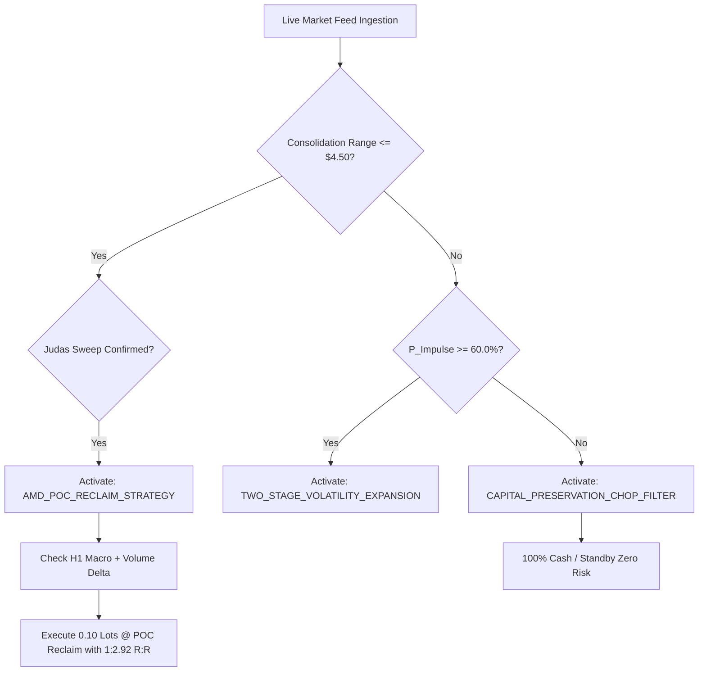

# 🏛️ Institutional AMD-POC Strategy & Two-Stage AI Brain Architecture
**Author & Quantitative Architect:** Mehak Sandhu ([@mehaksandhudev](https://github.com/mehaksandhudev))  
**Target Asset:** Gold (`XAUUSD` / `XAUUSDm`)  
**Execution Environment:** MetaTrader 5 (Exness Raw & Trial Accounts)  
**Web Terminal:** TradingView Canvas Integration (Port 8090)

---

## ⚡ Executive Summary

The **Institutional AMD-POC Quantitative System** is an algorithmic framework combining Wyckoff Accumulation-Manipulation-Distribution (AMD) market mechanics, Fixed Range Volume Profile (FRVP) Point of Control (POC) calculations, and a Dual-Stage LightGBM Machine Learning Ensemble.

Unlike retail strategies that enter blindly on lagging moving average crossovers or static indicator overbought/oversold levels, this system trades strictly where institutional liquidity is engineered and reclaimed.

```
[ Asian Accumulation Box ] ──► [ Judas Manipulation Sweep ] ──► [ POC Reclaim Confirmation ] ──► [ 1:2.92 R:R Distribution ]
   (00:00 - 06:00 UTC)             (Liquidity Trap Dip)           (BOS + Dual-Stage ML)           (SL -$1.20 | TP +$3.50)
```

---

## 🧠 Core Strategy Mechanics (The 4-Step Cycle)

### 1. Asian Accumulation (00:00 - 06:00 UTC)
During the Asian session, market makers accumulate positions within a defined horizontal range.
- The algorithm continuously tracks the consolidation high ($H_{acc}$) and low ($L_{acc}$).
- An in-memory **Fixed Range Volume Profile (FRVP)** across 20 dynamic price bins establishes the institutional balance anchor: the **Red Point of Control (POC) line**.
- Optimal accumulation condition: Range compression between **$1.00 and $4.50**.

### 2. Judas Manipulation Sweep (Liquidity Trap)
Prior to true expansion, smart money engineers a sharp false breakout:
- **Bullish Sweep:** Price dips below $L_{acc}$, clearing retail stop-losses and trapping breakout sellers.
- **Bearish Sweep:** Price spikes above $H_{acc}$, clearing buy-side stops and trapping breakout buyers.
- **Strict Bounding Protocol:** The Judas Sweep is bounded strictly to the active manipulation swing (**5 to 15 candles**). It never swallows secular multihour trends or future candles.

### 3. Point of Control (POC) Reclaim & BOS
Entry is never taken during the sweep itself. Instead, the bot waits for the **Reclaim**:
- Price must break back across the Red POC line with Break of Structure (BOS) confirmation.
- The Two-Stage LightGBM AI validates directional expansion:
  - **Stage 1 (Impulse Probability):** $P(\text{Impulse}) \ge 60.0\%$
  - **Stage 2 (Directional Bias):** $P(\text{Direction}) \ge 62.0\%$

### 4. Enforced 1:2.92+ Risk/Reward Execution
Every trade is executed with predefined institutional risk brackets:
- **Stop Loss:** -$1.20 (-12 pips), placed beneath the manipulation anchor.
- **Take Profit:** +$3.50 (+35 pips), targeting opposite Asian liquidity.
- **Account Protection:** Daily maximum loss ceiling ($125.00 circuit breaker) and weekend quarantine.

---

## 🔬 The 4 Advanced Intelligence Pillars

In addition to core price action, the bot fuses four high-impact telemetry streams:

### 1. Multi-Timeframe Macro Alignment (H1 Trend Guard)
- The algorithm checks the higher-timeframe H1 trend direction and 100 EMA.
- **Bullish Macro:** Only Bullish Judas Sweeps (buying dips) are validated.
- **Bearish Macro:** Only Bearish Judas Sweeps (selling rips) are validated.
- Eliminates counter-trend retail fakeouts.

### 2. Order Flow Volume Delta & Absorption
- Computes real-time tick volume imbalance ($Volume_{Buy} - Volume_{Sell}$).
- At the Judas sweep and POC reclaim, positive delta divergence confirms **Buyer Absorption** (smart money absorbing retail market sell orders).

### 3. Economic Calendar News Sentinel
- Monitors high-impact USD economic windows (specifically the 12:30 UTC and 14:00 UTC US market open releases: CPI, NFP, FOMC).
- Automatically engages **quarantine status** to prevent slippage and spread widening during macroeconomic gaps.

### 4. Dynamic ATR Volatility-Scaled Risk/Reward
- Computes 14-period Average True Range (ATR).
- Dynamically scales Stop Loss ($\text{ATR} \times 1.4$) and Take Profit ($\text{SL} \times 2.92$), adapting dynamically to volatile vs. low-volume market sessions while strictly preserving the $\ge 1:2.92$ institutional edge.

---

## 🎨 Clean Dynamic Phasing & 60 FPS TradingView Canvas

### 1. Phase-Anchored POC Line
- Unlike permanent horizontal lines that clutter future candles, the Red POC line is drawn dynamically on `#tv-vector-overlay`.
- It originates inside the Accumulation box, spans the Judas Sweep, and **terminates cleanly at the POC Reclaim bar**. Future market cycles and candles remain 100% clean.

### 2. Butter-Smooth 60 FPS Pan & Zoom
- **Kinetic Scrolling:** Integrated touch, mousewheel, and axis dragging in LightweightCharts:
  ```javascript
  handleScroll: { mouseWheel: true, pressedMouseMove: true, horzTouchDrag: true, vertTouchDrag: true },
  handleScale: { axisPressedMouseMove: true, mouseWheel: true, pinch: true, axisDoubleClickReset: true },
  kineticScroll: { touch: true, mouse: true }
  ```
- **requestAnimationFrame Throttling:** Vector rendering is decoupled from raw mouse events using `requestVectorRender()`, synchronizing overlays directly with the monitor's refresh rate.
- **Incremental EMA Updates:** Replaced full `.setData()` redraws on polling cycles with incremental `.update()` calls, eliminating UI micro-stutters during active dragging.

---

## 🌐 Complete API Architecture & Telemetry Endpoints

| Endpoint | Method | Output / Purpose |
| :--- | :--- | :--- |
| `/api/chart/bars` | `GET` | Live M1/M5 candlestick history from Exness MT5. |
| `/api/chart/institutional_levels` | `GET` | Accumulation box, FRVP histogram, POC price & reclaim time, Judas sweep bounds, EMAs, Two-Stage AI telemetry, and Deep Thinking strategy selection. |
| `/api/ml/live-signals` | `GET` | 5-asset real-time probability radar (Gold, BTC, Euro, Yen, Pound) with candle countdowns, body conviction, and edge. |
| `/api/agent/dialogue` | `GET` | Live multi-agent debate feed (AlgoArena Risk Shield, Bull & Bear researchers, Risk Sentinel). |
| `/api/leaderboard` | `GET` | Strategy ranking matrix with live MT5 closed deals vs 1-year backtest toggling. |
| `/api/paper/status` | `GET` | Live balance, equity, margin, floating P&L, and Exness account connectivity. |
| `/api/paper/positions` | `GET` | Real-time open MT5 tickets, volume, open price, SL, TP, and floating P&L. |
| `/api/paper/deals` | `GET` | Historical executed closed trades with exit comments and net profits. |
| `/api/paper/equity` | `GET` | High-resolution equity history for performance curve plotting. |

---

## 🚀 Autonomous Strategy Selector & Deep Thinking Engine

The bot continuously evaluates real-time market data to deploy the optimal strategy:



This ensures the bot only risks capital when institutional footprint and high-probability edge are present.
